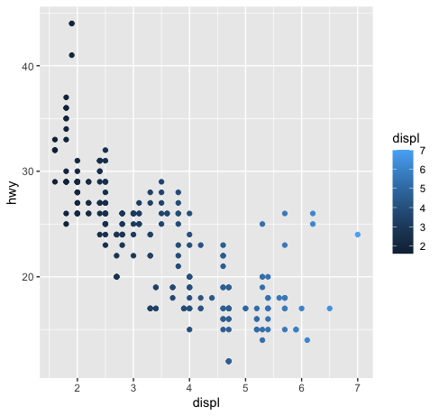

## Data Visualization  

1. Aesthetics are visual properties of an object, including color, shape, size, stroke etc. Therefore, to map an aesthetic to a variable, you should put "color=class" into geom_point(aes(…)) bracket.  
```
ggplot(data=mpg) + geom_point(aes(x=displ, y=hwy, color=class))
```

2. On the other hand, if you wanna make the points all in the same color, do not use "aes()", just add "color='red' " after aes.   
```
ggplot(data=mpg) + geom_point(aes(x=displ, y=hwy), color='blue')
```
**Note:** color = "blue" is a plotting characteristic, requiring quotes; color = class maps an aesthetic "color" to variable "class", without requiring quotes.  

3. Shapes can be divided into hollow ones and filled ones. They are assigned with different colors. Since shape = 21, the shapes are filled and should be adjusted with "fill=" to change its filled color.
```
ggplot(mpg) + geom_point(aes(x=displ,y=hwy, fill=drv), size=3, shape=21, color="white", stroke=3)
```
This code generate such a scatter plot with thick white contour:


4. Do not map an unordered variable to an ordered aesthetic. For example, "class" of cars is a discrete variable, while the aesthetic "size" is continuous.  

```
Warning: using size for a discrete variable is not advisable.
```

5. ggplot2 can only plot 6 shapes at a time. Variables with the other shapes will be ignored. This is the error message:  
```
Warning messages:
1: The shape palette can deal with a maximum of 6 discrete values because more than 6 becomes difficult to
discriminate; you have 7. Consider specifying shapes manually if you must have them.
2: Removed 62 rows containing missing values (geom_point).
```

6. A continuous variable could not map to shape. For example, cty is a continuous variable so this line of code does not work.  
```
ggplot(mpg) + geom_point(aes(x=cyl,y=hwy, shape=cty))
```

7. Aesthetics could map to boolean variables.  
```
ggplot(mpg) + geom_point(aes(x=displ,y=hwy, colour = displ < 5))
```


Compared with mapping to continuous variable displ:  
```
ggplot(mpg) + geom_point(aes(x=displ,y=hwy, colour = displ))
```


8. There are two ways to show more variables:  
First, use aesthetics as is shown above.  
Second, add facets.  
```
+ facet_wrap(~class, nrow=2) ##（一个variable，所以要说明nrow ） or
+ facet_grid(drv ~ cyl) ##（两个variables, 不用说明nrow）
```

9. ggplot2 provides 40+ geoms(geometrics). You can add up multiple geoms. When you wanna change an x or y object, you should update every geom() and might forget one. In this case, put the aes() into the global ggplot(data=..., aes()) and then add geoms.
```
ggplot(data = mpg, mapping = aes(x = displ, y = hwy)) +
  geom_point() +
  geom_smooth()
  ```

10. "se = F" outside aes() removes the standard error shadow on geom_smooth graph.
```
ggplot(data = mpg) +
+     geom_smooth(mapping = aes(x = displ, y = hwy), se=F)
```


11. stat = "identity": y = variable that is already given
    stat = "count": y = count the rows

    stat is not an aesthetic, so it is outside aes().

12. Difference between geom_bar and geom_col: geom_bar generates the count or proportion of a unique variable, while geom_col plots one variable on y axis to another on x axis.

13. geom_bar: if you wanna compute the proportion of a unique variable, remember to add "group=whatever" within aes(). This "group=" is a dummy grouping to override default values. Otherwise the height of all bars are 100%.

14. Set the barchart colors by "fill=" instead of "color=".

15.  Place the third classification variable (e.g. clarity) on bar chart by "position = 'dodge'".
```
ggplot(diamonds) + geom_bar(aes(x=cut, fill=clarity), position = 'dodge')
```


16. Sometimes the points overlap with others, so ggplot would display less points than the number of real variables. To see as many variables as possible, we can use ```geom_jitter(aes())```, which is the shorthand of ```geom_point(aes(), position = "jitter") ```. This adds randomness to each dot, though it makes your plot less accurate.
