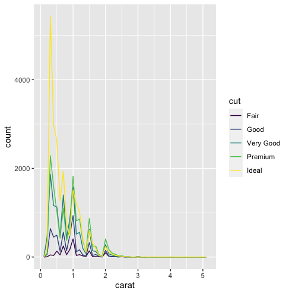
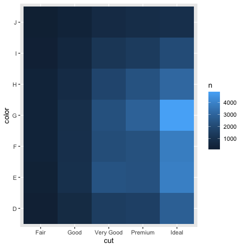
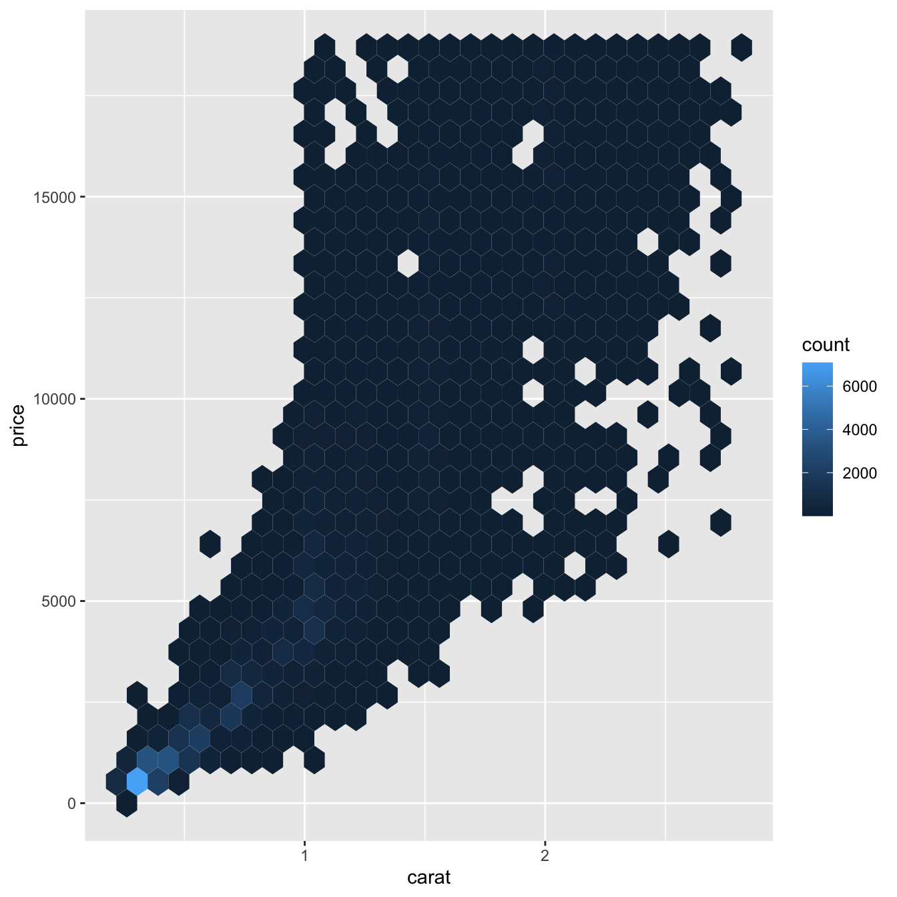
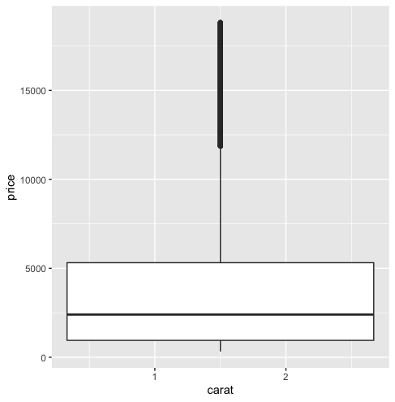
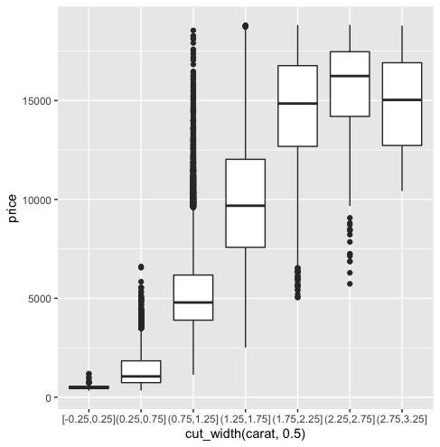
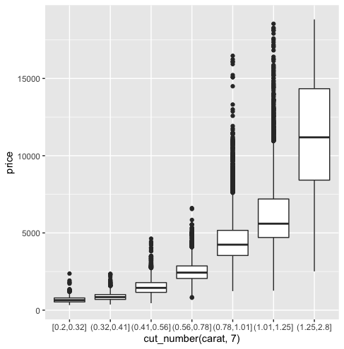

## Exploratory data analysis(EDA)

1. geom_bar(): discrete variables on x axis  
   geom_histogram(): continuous variables on x axis # you can set binwidth

2. If you wish to overlay multiple histograms in one plot, use ```geom_freqpoly()``` instead of ```geom_histogram()```.   

```
ggplot(diamonds) + geom_freqpoly(aes(x=carat, color=cut), binwidth = 0.1)
```



3. Zoom in with ```+coord_cartesian()```. For example, zoom into y axis from 0 to 50 (unit: count).

```
ggplot(diamonds) +
  geom_histogram(mapping = aes(x = y), binwidth = 0.5) +
  coord_cartesian(ylim = c(0, 50))
  ```

4. ifelse(if, result1, result2) # result1 is resulted from if condition; result2 is not.
```
diamonds %>% mutate(y = ifelse(y < 3 | y > 20, NA, y))
```
if y<3 or y>20, then replace y with NA, otherwise keep y.

5. When you got warning: "#> Warning: Removed 9 rows containing missing values (geom_point)." You should remove all the NA values beforehand.
```
ggplot(data = diamonds2, mapping = aes(x = x, y = y)) +
  geom_point(na.rm = TRUE)
```

6. %/%：求商  10%/%3 =  3  
    %%：取余数 10%%3 = 1

7. reorder(x, y, FUN): reorder x based on the function to y. 把y进行FUN计算，然后对x进行排序
```
ggplot(data = mpg) +
  geom_boxplot(mapping = aes(x = reorder(class, hwy, FUN = median), y = hwy))
  ```

8. Plot a correlation heatmap with ```+geom_tile()```. You need two **categorical variables**.
```
count <- count(diamonds, cut, color) # compute the number of each color in each cut.
ggplot(count) + geom_tile(aes(cut, color, fill=n)) # remember to add fill=n to add color.
```


9. Avoid overlapping points by using ```+geom_bin2d()```  or ```+geom_hex()``` (install package "hexbin"). They have color index.


10. When the variable on x axis is continuous, there would be only one box on the boxplot. However, you can bin that variable using ```cut_width(variable, binwidth)```.
```
ggplot(smaller) + geom_boxplot(aes(x=carat,y=price)) # one box
ggplot(smaller) + geom_boxplot(aes(x=cut_width(carat, 0.5),y=price)) # multiple boxes
```



"cut_width()" specifies the binsize, while "cut_number()" specifies the number of bins.
```
ggplot(smaller) + geom_boxplot(aes(x=cut_number(carat, 7),y=price))
```

